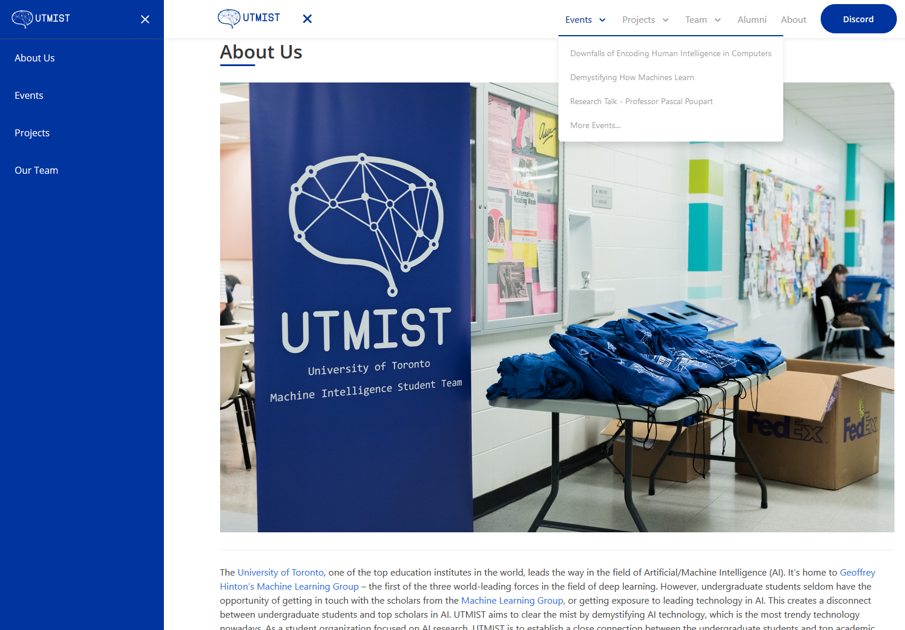

# utmist.gitlab.io



Club website for the [University of Toronto Machine Intelligence Student Team (UTMIST)](https://utmist.gitlab.io).

Need help? [Read the Wiki](https://gitlab.com/utmist/utmist.gitlab.io/-/wikis).

## Overview

- [Google Sheets](https://developers.google.com/sheets) serve as databases.
- The **fetcher** package pulls from the databases and populates **Associate**, **Event**, and **Project** objects.
- The **generator** package uses the objects fetched to generate **markdown** content pages.
- **Hugo** generates the static site website locally or with **GitLab Pages**.

### Connections

- The fetcher/generator and Hugo are run in [GitLab CI](https://docs.gitlab.com/ce/ci/) and fed into [GitLab Pages](https://docs.gitlab.com/ce/user/project/pages/).
- The [UTMIST Assistant (MISTA)](https://gitlab.com/utmist/mista) can trigger a job to regenerate when responding to commands in our [Discord Server](https://discord.gg/88mSPw8). If MISTA is offline, jobs must be triggered manually through the [GitLab CI/CD Pipeline Manager](https://gitlab.com/utmist/utmist.gitlab.io/pipelines).

### Prerequisites

- [Go](https://golang.org/). Put this project in `$GOPATH/utmist/utmist.gitlab.io`.
- [Hugo](https://github.com/gohugoio/hugo/releases), `>= 0.61`. GitLab CI uses `0.66`.

### Dependencies

- [godotenv](https://pkg.go.dev/github.com/joho/godotenv)
- [Google Sheets API for Go](https://pkg.go.dev/google.golang.org/api)

## Details

Full details can be found on [our Wiki](https://gitlab.com/utmist/utmist.gitlab.io/-/wikis).

- [Content Management](https://gitlab.com/utmist/utmist.gitlab.io/-/wikis/Content-Management)
- [Development](https://gitlab.com/utmist/utmist.gitlab.io/-/wikis/Development)
- [Website Updates](https://gitlab.com/utmist/utmist.gitlab.io/-/wikis/Website-Updates)

### GitLab

- We use GitLab CI and GitLab Pages to host this website.
  - GitLab CI has its own environment registry.

### Usage

- Clone the repository under `$GOPATH/gitlab.com/utmist/` and initialize theme submodule.

  ```sh
  git clone https://gitlab.com/utmist/utmist.gitlab.io.git
  git submodule update --init --recursive
  ```

- Paste the environment variables. Refer to `.env.copy` for the required variables.
- Run the `fetcher/generator` script.

  ```sh
  go run main.go
  ```

  Or if you prefer to compile first.

  ```sh
  go build
  ./utmist.gitlab.io
  ```

- Run `hugo` in debugging mode to host the website on `localhost:1313`.

  ```sh
  hugo server -D
  ```

## Development

- This project is maintained by the [Infrastructure Department at UTMIST](https://utmist.gitlab.io/team/infrastructure).
  - [Robert (Rupert) Wu](https://leglesslamb.gitlab.io), VP Infrastructure.
- If you’re a member of UTMIST and would like to contribute or learn development through this project, you can join our Discord) and let us know in #infrastructure.

## Acknowledgements

- [Salim Anvarov](https://msanvarov.github.io/personal-portfolio) for advising on Docker and Go Modules.
- [Lingkai (Rain) Shen](https://www.linkedin.com/in/lingkai-shen/) for building [utmist.github.io](https://github.com/utmist.github.io) and advising on Google Sheets.
